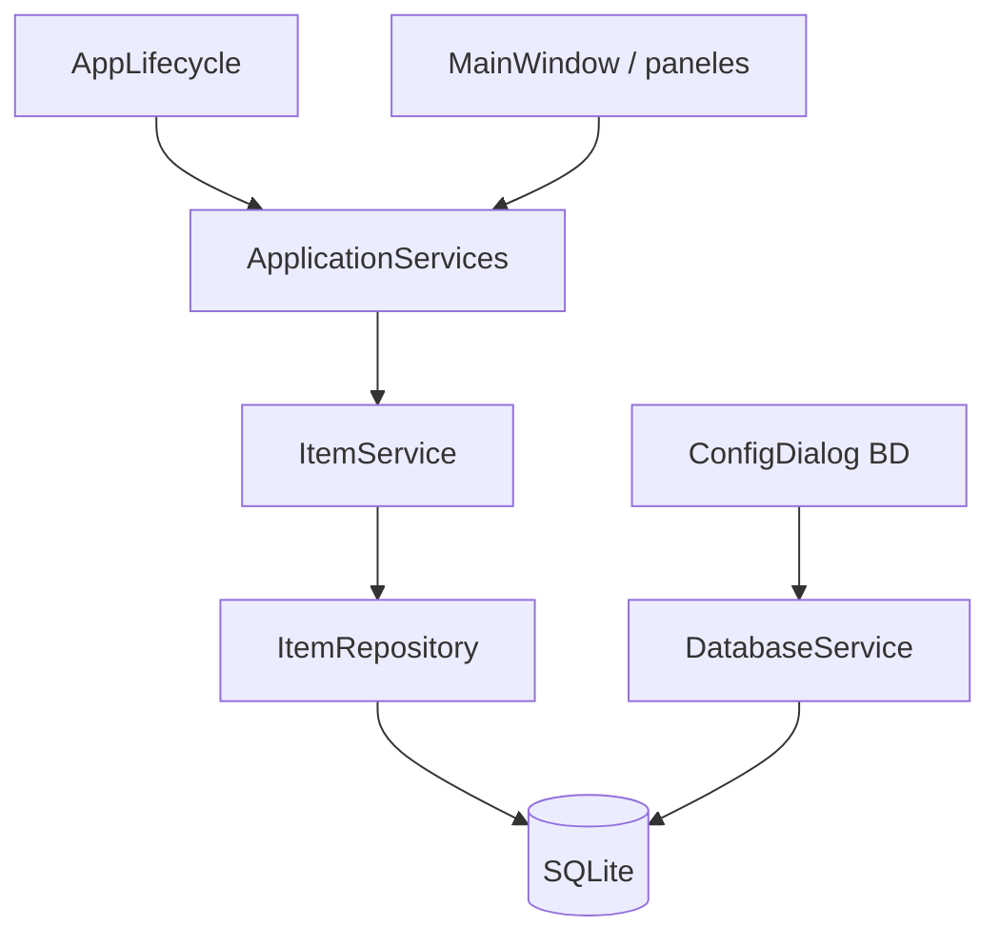

# Capa core — lógica de negocio

Servicios de dominio independientes de PyQt6. Consumen repositorios de `db/` mediante inyección de dependencias.

## Fase 3 (implementada)

| Componente | Rol |
|------------|-----|
| `ApplicationServices` | Contenedor único de servicios |
| `ItemService` | CRUD de items + validaciones de dominio |
| `ValidationError` / `DuplicateNameError` | Errores de negocio |

## Arquitectura



- **Configuración / mantenimiento BD**: sigue usando `DatabaseService` (infraestructura).
- **Datos de dominio**: la GUI debe usar `ApplicationServices` (fase 4).

## ItemService

```python
services.items.create_item(name, description)
services.items.update_item(id, name, description)
services.items.list_items()
services.items.search_items(query)
services.items.get_item(id)
services.items.delete_item(id)
services.items.count_items()
```

### Validaciones

- Normalización de espacios en nombres
- Nombre no vacío; límites de longitud
- Nombre único (insensible a mayúsculas)

## Integración en arranque

`AppLifecycle._init_database()` crea `DatabaseService`, luego:

```python
self.app_services = ApplicationServices.from_database_service(self.database_service)
```

Se pasa a `MainWindow` como `app_services=...`.

## Añadir un servicio

1. Crear `core/services/mi_servicio.py`
2. Registrar en `ApplicationServices`
3. Tests en `tests/core/`
4. Exponer en GUI (fase 4)

## Próxima fase

| Fase | Contenido |
|------|-----------|
| 4 | Panel 1 — CRUD de items (`ItemsPanelWidget` + `ItemEditDialog`) |
| Monitor | Servicios `monitor/` — SDR, supervisión, alarmas — ver `docs/monitor.md` |

## Documentación relacionada

| Área | Documento |
|------|-----------|
| Inventario RF | `docs/inventario_edicion.md`, `docs/inventario_bd.md` |
| Import Workbench | `docs/import_workbench.md` |
| Monitor SDR | `docs/monitor.md` |

## Tests

```powershell
python -m pytest tests/core -v
.\scripts\run_db_tests.ps1
```
