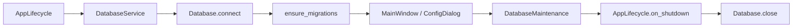

# Capa de base de datos

Arquitectura genérica de persistencia relacional para la plantilla.

## Fases implementadas

| Fase | Contenido |
|------|-----------|
| 1 | Conexión SQLite, transacciones, migraciones, cierre ordenado |
| 1b | Configuración persistente, mantenimiento y pestaña en Configuración |
| 2 | `BaseRepository`, modelo `Item`, `ItemRepository`, migración `003_items` |
| 3 | `ApplicationServices` + `ItemService` en `core/` |
| 4 | Panel 1 GUI — CRUD items (`gui/items_panel_widget.py`) |

## Principios

- Sin dependencias de PyQt6 en el núcleo (`db/`); la GUI solo consume `DatabaseService`
- SQLite en la biblioteca estándar (`sqlite3`)
- Parámetros en `workspaces.json` → `config.database`
- Migraciones versionadas en código (no ORM)

## Estructura

```
src/db/
  config.py         # DatabaseConfig
  settings.py       # DatabaseSettings (persistencia)
  connection.py     # Database
  maintenance.py    # DatabaseMaintenance (integridad, VACUUM, backup…)
  service.py        # DatabaseService (orquestación)
  migration.py      # schema_version + apply_migrations
  models/           # Entidades (Item)
  repositories/     # BaseRepository + ItemRepository
  exceptions.py     # DatabaseError, RecordNotFoundError
  README.md
```

## Flujo en la aplicación



## Configuración (GUI)

Menú **Herramientas → Configuración → Base de datos**:

| Parámetro | Descripción |
|-----------|-------------|
| Archivo SQLite | Nombre del fichero dentro del directorio de datos |
| Timeout | Segundos de espera en bloqueos |
| Journal mode | WAL, DELETE, etc. |
| Foreign keys | ON/OFF |
| Synchronous | OFF, NORMAL, FULL, EXTRA |
| Directorio de copias | Vacío → `data/backups/` |
| Copia al iniciar | Backup automático en arranque |

## Mantenimiento (`DatabaseMaintenance`)

| Método | Acción |
|--------|--------|
| `get_status()` | Ruta, tamaño, pragmas, migraciones, tablas |
| `check_integrity()` | `PRAGMA integrity_check` |
| `vacuum()` | Compactar fichero |
| `analyze()` | Actualizar estadísticas del optimizador |
| `backup()` | Copia con API `connection.backup()` |
| `apply_migrations()` | Migraciones pendientes |

Botones equivalentes en la pestaña **Base de datos** del diálogo de configuración.

## Esquema actual (migraciones 001–004)

| Tabla | Uso |
|-------|-----|
| `schema_version` | Control de migraciones aplicadas |
| `app_metadata` | Clave-valor genérico |
| `items` | Entidad de ejemplo (name, description, timestamps) |
| `inventory_channels` | Canales RF del inventario por proyecto (CONTROLADORF) |

## Modo desarrollador

En **Herramientas → Configuración → General**, la casilla **Modo desarrollo** desbloquea herramientas de administrador (contraseña local, no persistida). El flag `developer_mode` se guarda en `workspaces.json` → `config`.

| Nivel | Pestaña BD |
|-------|------------|
| Usuario | Resumen: estado, ruta, tamaño, registros por tabla |
| Desarrollador | Conexión, PRAGMA, backup, explorador, SQL, mantenimiento |

Ver también `docs/inventario_bd.md`.

### Tablas previstas — Monitor (fase M4)

| Tabla | Uso |
|-------|-----|
| `monitor_alarms` | Histórico de alarmas RF (canal, severidad, medida, umbral, ack) |
| `monitor_measurements` | *(opcional)* muestreos periódicos para tendencias |

Diseño en **`docs/monitor.md`**; migraciones pendientes de implementación.

## Repositorios (fase 2)

### BaseRepository

Operaciones comunes: `count`, `exists`, `get_by_id`, `get_by_id_or_raise`, `list_all`, `delete`.

### ItemRepository

| Método | Descripción |
|--------|-------------|
| `create(name, description)` | Inserta y devuelve el item |
| `update(item)` | Actualiza name/description |
| `find_by_name(name)` | Búsqueda exacta (case insensitive) |
| `search_by_name(query)` | Búsqueda parcial LIKE |

Acceso desde la app: `database_service.items` (preferible vía `app_services.items` en core).

### Añadir un nuevo repositorio

1. Modelo en `db/models/`
2. Migración en `MIGRATIONS`
3. Repositorio heredando de `BaseRepository`
4. Tests en `tests/db/`

## Uso desde código

```python
from db import DatabaseService, DatabaseSettings

service = DatabaseService(
    data_dir="src/workspace/data",
    store_get_config=store.get_config,
    store_set_config=store.set_config,
)
service.startup()

item = service.items.create("Ejemplo", "Descripción")
all_items = service.items.list_all()
service.items.delete(item.id)

ok, msg = service.maintenance.check_integrity()
service.maintenance.backup()

service.close()
```

## Próximas fases

| Fase | Contenido |
|------|-----------|
| — | Ampliar entidades, más paneles, filtros avanzados |

## Tests

```powershell
.\scripts\run_db_tests.ps1
```

Incluye `tests/db/` (conexión, migraciones, settings, maintenance, service, item_repository) y smoke `scripts/test_db_repositories.py`.
