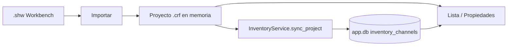

# Inventario RF y base de datos SQLite

Guía práctica para entender cómo CONTROLADORF persiste el inventario y cómo inspeccionarlo **fuera de la aplicación**.

## Dos capas de datos

| Capa | Fichero | Contenido |
|------|---------|-----------|
| **Documento del show** | `*.crf` (JSON) | Proyecto completo: inventario, coordinación, UI de paneles |
| **Base de datos local** | `app.db` (SQLite) | Copia indexada del inventario RF por proyecto (consultas, futuro CRUD) |

El `.crf` es la fuente de verdad del proyecto. La BD se **sincroniza** desde el inventario del proyecto abierto.

## Dónde está la base de datos

Por defecto, junto al workspace de la app:

```
src/workspace/data/app.db
src/workspace/data/workspaces.json   ← configuración global (incl. nombre del fichero SQLite)
```

Ruta completa en tu máquina (ejemplo):

`C:\Users\josea\Documents\Informatica\Python\ControladoRF\ControladoRF V1\ControladoRF V1\src\workspace\data\app.db`

### Ver la ruta desde la app

1. **Herramientas → Configuración → Base de datos** — campo «Ruta completa».
2. Tras importar o refrescar inventario — mensaje en la **barra de estado**:  
   `Inventario en BD: N canales · ruta\app.db`

## Cuándo se escribe en la BD

- Al **arrancar** la app: migraciones (`001`…`005`) crean/actualizan tablas si faltan.
- Tras **importar Workbench**, abrir proyecto o refrescar el panel Lista:  
  `InventoryService.sync_project()` reemplaza los canales del proyecto en `inventory_channels`.

## Esquema relevante (migraciones `004` + `005`)

### Canales (`004_inventory_channels` + columnas `005`)

```sql
SELECT project_key, channel_key, channel_name, notes, color, locked, device_type
FROM inventory_channels;
```

### Metadatos lista/grupo (`005_inventory_scope_metadata`)

```sql
SELECT scope_type, group_mode, group_key, notes, color, locked
FROM inventory_scope_metadata
WHERE project_key = '...';
```

Campos principales de canales:

| Columna | Significado |
|---------|-------------|
| `project_key` | Ruta del `.crf` (minúsculas) o `unsaved:nombre` si no está guardado |
| `channel_key` | ID estable del canal (Workbench ID o clave compuesta) |
| `device_type` | `microphone`, `iem`, etc. |
| `payload_json` | Resto de campos del dict de inventario |
| `notes` | Notas del canal |
| `color` | Color `#RRGGBB` del canal |
| `locked` | Bloqueo del canal (0/1) |

Metadatos de **lista completa** y **grupos** viven en el `.crf` (`list_metadata`, `group_metadata`) y se reflejan en `inventory_scope_metadata`.

Ver también: [inventario_edicion.md](inventario_edicion.md) (CRUD, foco, atajos, bloqueo).

## Cómo abrir la BD desde fuera

### 1. DB Browser for SQLite (recomendado)

1. Descargar [DB Browser for SQLite](https://sqlitebrowser.org/).
2. **Abrir base de datos** → seleccionar `app.db`.
3. Pestaña **Examinar datos** → tabla `inventory_channels`.

> Cierra CONTROLADORF o ten en cuenta el modo WAL: a veces conviene copiar `app.db` a otra carpeta antes de abrirlo.

### 2. Línea de comandos (`sqlite3`)

```powershell
cd "ruta\al\proyecto\src\workspace\data"
sqlite3 app.db
```

```sql
.tables
SELECT COUNT(*) FROM inventory_channels;
SELECT channel_name, model, device_type FROM inventory_channels LIMIT 10;
.quit
```

(Si no tienes `sqlite3`, instálalo o usa DB Browser.)

### 3. Desde Python (mismo entorno del proyecto)

```powershell
$env:PYTHONPATH="src"
python -c "
from pathlib import Path
from db.config import DatabaseConfig
from db.connection import Database
from db.migration import ensure_migrations

db = Database(DatabaseConfig(path=Path('src/workspace/data/app.db')))
db.connect()
ensure_migrations(db)
rows = db.fetchall('SELECT project_key, channel_name, device_type FROM inventory_channels LIMIT 5')
for r in rows: print(dict(r))
db.close()
"
```

## Flujo interno (resumen)



## Copias de seguridad

**Herramientas → Configuración → Base de datos → Copia de seguridad ahora**

Por defecto las copias van a `src/workspace/data/backups/`.

## Referencias

- Capa genérica BD: `docs/db.md`
- Código: `src/db/migration.py`, `src/core/services/inventory_service.py`
