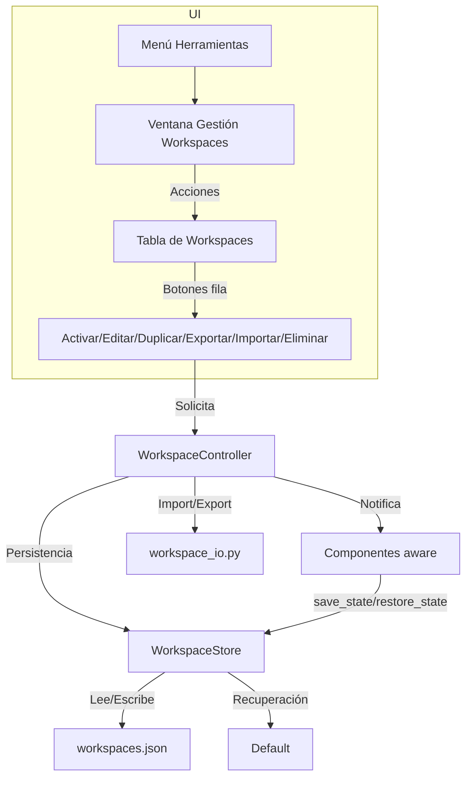

# Gestión profesional de workspaces

"""
README del módulo workspace
--------------------------
Propósito: Gestionar la lógica, modelos, controladores y utilidades para la gestión avanzada y profesional de workspaces.

Premisas:
- Persistencia robusta y restauración fiable del estado de la aplicación por workspace.
- Modularidad, validación y desacoplamiento de la UI y la lógica de negocio.
- Documentación exhaustiva y tests automáticos para todos los componentes.

Este módulo es clave para la experiencia de usuario personalizada y la integridad de la configuración.
"""

Esta carpeta contiene la lógica, modelos, controladores y utilidades para la gestión avanzada de workspaces en la aplicación. Aquí se almacena el archivo workspaces.json, que contiene todos los workspaces, su configuración, metadatos y preferencias.

## Diagrama general de la gestión de workspaces



# Guía profesional de persistencia y gestión de workspaces

## CICLO DE VIDA DEL ARRAY DE WORKSPACES (PATRÓN PROFESIONAL)

- Al iniciar la app, se carga el array completo de workspaces desde el JSON a memoria.
- El workspace activo es una referencia a uno de los objetos del array.
- Cada vez que el usuario realiza un cambio visual relevante (por ejemplo, modifica el ancho de una columna, el estado de un panel, etc.), el componente correspondiente publica el cambio y actualiza el objeto workspace activo en memoria (en su campo `config`).
- El array de workspaces en memoria es la única fuente de verdad durante la sesión.
- Al cerrar la app, se guarda el array completo de workspaces (con todos los valores actualizados) de vuelta al JSON de forma atómica, garantizando que ningún cambio visual relevante se pierda.
- Al abrir la app, se recupera el array y se restaura el estado visual de todos los componentes aware registrados.

## PATRÓN DE PERSISTENCIA POR WORKSPACE (OBLIGATORIO)

- Todo componente (ventana, tabla, panel, widget, splitter, dock, etc.) que tenga estado modificable por el usuario debe:
  * Implementar `save_state(self) -> dict` (devuelve un dict serializable con TODO lo modificable por el usuario: tamaños, posiciones, selecciones, orden de columnas, pestaña activa, etc.)
  * Implementar `restore_state(self, config: dict)` (recibe el config del workspace activo y restaura TODO el estado relevante)
  * Registrarse en el controlador con `controller.register_component(self)` (implementando `WorkspaceAware`).
- El controlador llamará automáticamente a estos métodos al cambiar de workspace o guardar.
- Si el componente no necesita guardar nada, `save_state` debe devolver `{}` y `restore_state` aceptar el argumento pero no hacer nada.
- Si la app crece (más ventanas, tablas, paneles, etc.), cada uno debe seguir este patrón para garantizar la persistencia y restauración por workspace.
- **Nunca dependas solo de eventos de celda o señales de UI para guardar estado: sincroniza siempre el modelo con la vista antes de guardar.**

## workspaces.json
- Contiene un array con todos los workspaces y su configuración.
- Al cerrar la aplicación, se guarda el estado actual de todos los workspaces en este archivo.
- El primer registro es el workspace por defecto, pero se carga el último que se usó.
- En cada workspace se almacena TODO lo susceptible de modificación por el usuario.

### Ejemplo de estructura de workspaces.json
```json
{
  "config": {
    "language": "es_ES",
    "backup_path": "C:/Users/usuario/Documents"
  },
  "workspaces": [
    {
      "name": "Default",
      "description": "Configuración por defecto",
      "config": { ... },
      "is_default": true
    },
    {
      "name": "otro",
      "description": "Workspace personalizado",
      "config": { ... },
      "is_default": false
    }
  ],
  "last_active_workspace": "Default"
}
```

- Los valores en `config` global son parámetros de la app (idioma de respaldo, ruta de backup, etc.).
- El array `workspaces` contiene toda la personalización editable por el usuario para cada espacio.
- El campo `last_active_workspace` indica el workspace que debe restaurarse al abrir la app.

### Ejemplo de last_workspace.txt
```
Default
```

**No borres ni modifiques el workspace "Default".** Si el archivo se corrompe, restaura el backup o elimina workspaces.json para regenerar la estructura mínima.

### Añadir metadatos
Puedes añadir campos extra en cada workspace (por ejemplo, "usuario", "fecha_creacion"). El sistema es tolerante y los campos desconocidos se ignoran.

## Barra de estado y gestión visual
- En la barra de estado se muestra el nombre del workspace activo como botón.
- Al pulsar el botón, se abre `WorkspaceManagerDialog` (`gui/workspace_manager.py`).
- La tabla muestra columnas: Nombre, Descripción, Activo (Sí/No) y Acciones.
- Toolbar: Nuevo, Importar. Import sobre Default desde la fila Default.
- Import/export JSON vía `workspace_io.py` y métodos del controlador (`import_workspace`, `export_workspace`, `duplicate_workspace`, `rename_workspace`).
- El diálogo se registra como componente aware al abrir y se desregistra al cerrar.
- Al cambiar de workspace, se llama a `restore_state` de todos los componentes registrados para cargar su configuración específica.

## Elementos gráficos que deben ser aware (persistentes por workspace)

1. **Ventana principal y diálogos**
   - Geometría (tamaño y posición)
   - Estado maximizado/minimizado
   - Estado de paneles acoplables (visibilidad, posición, tamaño)
2. **Tablas y listas**
   - Ancho, orden y visibilidad de columnas
   - Selección de filas/celdas
   - Orden de ordenación (sorting)
   - Scroll y posición de vista
3. **Paneles acoplables (dock widgets)**
   - Posición (dock area)
   - Estado abierto/cerrado
   - Tamaño
4. **Splitters**
   - Tamaño relativo de cada panel
5. **Pestañas (tab widgets)**
   - Pestaña activa
   - Orden de las pestañas (si es editable)
6. **Configuraciones de usuario**
   - Idioma y preferencias de usuario específicas del workspace (layout, tablas, etc.)
7. **Cualquier widget editable**
   - Texto, selección, estado de checkboxes, etc., si es relevante para la experiencia del usuario y debe restaurarse al volver al workspace

## Checklist para nuevos componentes
- [ ] ¿El componente tiene algún estado modificable por el usuario?
- [ ] ¿Implementa `save_state` y `restore_state`?
- [ ] ¿Está registrado en `WorkspaceController.register_component()`?
- [ ] ¿Se ha probado que al cambiar de workspace/restaurar sesión, el estado se recupera correctamente?
- [ ] ¿Hay test de integración para la persistencia/restauración?

## Ejemplo mínimo de componente aware

```python
from workspace.aware import WorkspaceAware
from PyQt6.QtWidgets import QSplitter

class MySplitter(QSplitter, WorkspaceAware):
    def save_state(self):
        return {"splitter_sizes": self.sizes()}

    def restore_state(self, config):
        sizes = config.get("splitter_sizes")
        if sizes:
            self.setSizes(sizes)

controller.register_component(my_splitter)
```

---

## Resumen para desarrolladores: ciclo de vida y persistencia

- Al iniciar la app, el array de workspaces se carga desde el JSON a memoria y el workspace activo es una referencia a uno de esos objetos.
- Cada vez que el usuario realiza un cambio visual relevante (por ejemplo, modifica el ancho de una columna, el estado de un panel, etc.), el componente correspondiente publica el cambio y actualiza el objeto workspace activo en memoria (en su campo `config`).
- El array de workspaces en memoria es la única fuente de verdad durante la sesión.
- Al cerrar la app, el ciclo de vida está centralizado en `app_lifecycle.py`: se llama a `save_active_workspace()` para publicar cualquier cambio pendiente y luego se guarda el array completo de workspaces al JSON de forma atómica usando `store.save_all()`. Así se garantiza que ningún cambio visual relevante se pierda.
- Al abrir la app, se recupera el array y se restaura el estado visual de todos los componentes aware registrados.

**Checklist para nuevos desarrolladores:**
- Si creas un nuevo componente visual con estado editable, implementa `save_state` y `restore_state` y registra el componente en el controlador.
- Publica los cambios visuales relevantes llamando a un método de actualización (por ejemplo, `_save_table_state()` en tablas).
- No es necesario guardar manualmente en disco tras cada cambio: el array en memoria es la fuente de verdad y se persiste automáticamente al cierre.
- El flujo está documentado y centralizado para facilitar el mantenimiento y la extensión.

## Ejemplo avanzado: persistencia de tablas en WorkspaceManagerDialog

```python
# Guarda anchos, orden y selección de columnas
state = {}
widths = [self.table.columnWidth(i) for i in range(self.table.columnCount())]
state['workspace_table_column_widths'] = widths
order = [self.table.horizontalHeader().visualIndex(i) for i in range(self.table.columnCount())]
state['workspace_table_column_order'] = order
selection = [idx.row() for idx in self.table.selectionModel().selectedRows()]
state['workspace_table_selection'] = selection
# ...
```

## Cómo añadir persistencia a nuevos objetos gráficos

1. Hereda de WorkspaceAware o registra el componente en el controlador.
2. Implementa `save_state` para devolver un diccionario con todos los parámetros editables relevantes.
3. Implementa `restore_state` para restaurar esos parámetros desde el diccionario.
4. Usa nombres descriptivos y únicos para cada parámetro en el diccionario.
5. Prueba el flujo: cambia de workspace, modifica la UI, vuelve al workspace anterior y verifica que todo se restaura correctamente.
6. Añade tests de integración si es posible.

### Ejemplo para otro programador

```python
from workspace.aware import WorkspaceAware
from PyQt6.QtWidgets import QTableWidget

class MiTabla(QTableWidget, WorkspaceAware):
    def save_state(self):
        return {
            'anchos_columnas': [self.columnWidth(i) for i in range(self.columnCount())],
            'orden_columnas': [self.horizontalHeader().visualIndex(i) for i in range(self.columnCount())]
        }
    def restore_state(self, config):
        widths = config.get('anchos_columnas')
        if widths:
            for i, w in enumerate(widths):
                self.setColumnWidth(i, w)
        order = config.get('orden_columnas')
        if order:
            for logical, visual in enumerate(order):
                self.horizontalHeader().moveSection(self.horizontalHeader().visualIndex(logical), visual)
```

## Notas
- El patrón es extensible y profesional. Si tienes dudas, revisa los ejemplos en MainWindow y WorkspaceManagerDialog.
- Mantén esta guía actualizada y revisa la checklist en cada PR.
